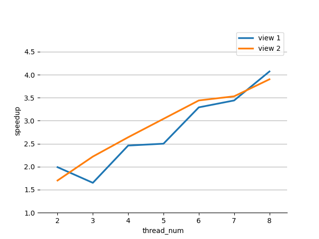
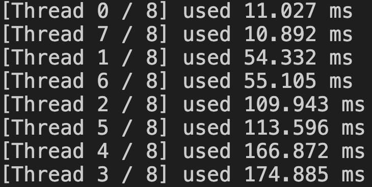
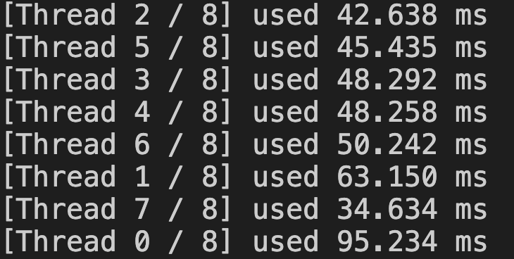

# Program 1: Parallel Fractal Generation Using Threads

1. ``output[j][i]`` is the iterations to achieve $|z_n|^2 > 4$ for $c = c_{re} + c_{im}\ i$. $c_{re} = x0 + dx \times i$, and $c_{im} = y0 + dy \times j$. Here $dy$ and $dx$ is the accuracy determined by the recolution of the image we want, namely $dx = \frac{x1 - x0}{width}$ and $\frac{y1 - y0}{height}$. 
   The calculation of $c_{re}$ and $c_{im}$ is based on ``x0``, ``y0``, ``dx``, ``dy``, ``i`` and ``j``. So for each thread, the first five variables should be the same, while only calculate the corresponding ``j``, which is determined by ``startRow`` and ``numRows``. 
   I keep ``x0``, ``x1``, ``y0``, ``y1``, ``width``, ``height``, and set differet ``startRow`` and ``numRows``. Each thread should at least process $\leftfloor\frac{height}{num_threads}\rightfloor$ rows. If there are some residual rows, assign each of the first several threads one more row. 

2. The graph is as below. The speedup is not linear in the number of threads used. Examine the picture generated, although the number of rows were assigned evenly, but the calculation of each row is not equal. For view 1, the rows in the middle have a more significan burden in calculation, while in view 2, the rows at the begining are harder to calculate.   
    Picture 1.1: The speedup of different number of threads. 
   
   

3. For view 1, threads numbered in the middle need more time to complete. While for view 2, threads numbered at the beginning need more time. So this confirmed my explain above.   
    Picture 1.2: The times usage of each thread in view 1
    
   Picture 1.3: The time usage of each thread in view 2
   
   

4. I used the interleaved assignment by implementing another ``mandelbrotInterleave`` function, which only need to change the for-loop of ``j`` in ``mandelbrotSerial``, and no need for calculating the ``startRow`` and ``numRows``. 
   Finally, I achieved $7.58\times$ in view 1, and $7.48\times$ in view 2. 

P.S. those data were achieved when running by iTerm. If I run the program by the integrated terminal in VSC, it has only about $5\times$, probably due to its limitation on the number of threads it can create. 

5. No. Because the CPU cannot run 16 threads at the same time. So even if I created 16 threads, some of them will wait, and share resource with other threads. Thus the burden of each hardware thread is not even. 

# Program 2: Vectorizing Code Using SIMD Intrinsics

1. The logic of SIMD execution is that the arithmatic units run the same instructions, but the data have an offset of 1 to their previous unit. The code only controls the first unit, so the for-loop starts from 0, and step by VECTOR_WIDTH. 
   The implementation of ``while-loop`` needs the help of ``cntbits`` to break only when all units have finished. The loop condition is set to the ``cntbits``, while the mask is calculated before according to the original loop condition in serial code. 
   To avoid the last extra unit write out of bound, we need to set the mask with only the first several values being 1 at the last iteration. Since only the first unit has a sense of ``i``, we cannot make the mask with those un-vectorized variables. 

2. The vector utilization is as followed. They decrease as VECTOR_WIDTH increases. 
   Because with the more vector units executing together, the probablity of the rest units waiting for one unit to finish the while-loop increases, and more units spend more time in waiting. 
   
   | VECTOR_WIDTH | vector utilization |
   |:------------:|:------------------:|
   | 2            | 84.9%              |
   | 4            | 80.1%              |
   | 6            | 78.5%              |
   | 8            | 77.6%              |
   | 16           | 76.4%              |

3. A natural idea is to calculate the partial sum per unit, and add them all together after all the data processed. 
   Those created ``vec_float`` and ``vec_int`` are actually arrays, and each vector unit will only operate one element of them. So the partial sum should be a ``vec_float``. 
   Producing the partial sum costs $O(N / VECTOR_WIDTH)$, and with the help of ``hadd`` and ``interleave``, producing the final sum only costs $O(log_2(VECTOR_WIDTH))$. 

# Program 3: Parallel Fractal Generation Using ISPC

## Part 1. A Few ISPC Basics

1. The expected maximum speedup is $8\times$, since ``foreach`` only generate an SIMD thread, and cannot use the superscalar part and other cores. 

2. Because the pixels are determined by the loop-count of each complex number, so the SIMD has to mask several lanes, which causes the decrease speedup. 

3. The chanllenge is the divergent execution between pixels. 

## Part 2. ISPC Tasks

1. The speedup of ``mandelbrot_ispc --task`` is $10.01\times$. And the speedup over ``mandelbrot_ispc`` is $1.98\times$

2. In the document, the suggestion is as following: 
   
   > "In general, one should launch many more tasks than there are processors in the system to ensure good load-balancing, but not so many that the overhead of scheduling and running tasks dominates the computation. "
   
   Given the code in ``mandelbrot_ispc_task``, I know that each task is divide by chunk, not interleave. For the reason expressed in Problem 1.2, I would like to divide tasks so many that might go in a way similar to interleave method. In this situation, the tasks spawned should divide the height. 
   Finally, I chose ``80`` tasks, and achieved a speedup of $51.26\times$. 

3. ISPC tasks are not threads, but an abstraction that tell the compiler what independent units of work exist in your program. The ISPC compiler will create threads considering both the number of ISPC tasks and the hyper-threads, namely not more than either. If ISPC tasks are more than hyper-threads, than compiler will assign them to different threads. So the overhead of tasks is less than threads. 

# Program 4: Iterative sqrt

1. The speedup is $4.53\times$ for single CPU core, and $45.24\times$ for all CPU cores. So $4.53\times$ due to SIMD parallelization, and $9.98\times$ due to multi-core parallelization. 

2. If all the values are set to ``2.999f``, the speedup is $7.19\times$ for singel CPU, and $66.81\times$ for all CPU cores. 
   It does improved the SIMD speedup, since all data have the same loop-count, and thus no masked lane. 
   It doesn't improve the multi-core parallelization, because the number of hyper-threads is the same, and the distribution of random values is quite even. 

3. I set all values to ``1.f``, except for those whose index can be divided by 8 which is ``2.999f``. The speedup is $0.96\times$ for single CPU core, and $8.94\times$ for all CPU cores. The loss in efficiency is due to the imbalance burden between the vector units in one core. The last 7 units waiting for the first unit to finish the calculation of ``2.999f``. 

# Program 5: BLAS saxpy

1. The speedup from using ISPC with tasks is $1.04\times$. The speedup is limited by the memory access bandwidth, so I don't think it can be substantially improved. At the beginning, I thought it might be the imbalance calculation between cores, so I change the launch to 1000, which should improve a lot on the imbalance. But the speedup is still only $1.15\times$, which means the distribution is not the bottleneck. 

2. In memory system, when saxpy loads one element from X and one element from Y, CPU will copy the data to cache. And when saxpy writes one element to result, CPU will copy the data to cache, write the data in cache, and write the data in cache to memory later. So there is actually one more memory access when writing the result to cache. 

3. A cheating approach is that X[i] = Y[i] = i, so there is no need to access X and Y, which saves half access request. The speedup is $2.05\times$, but only suit this specific situation, and **I don't like it**. Other way like access X[i] instead of Y[i] is similar, and **I don't like it either**. 