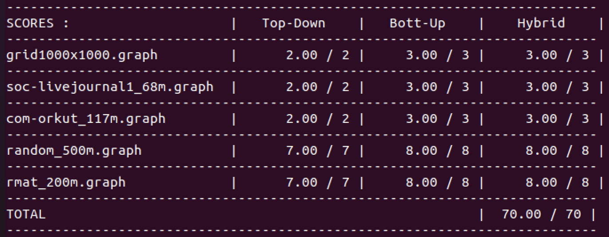

# Part 1: Warm up: Implementing Page Rank

# Part 2-4: Parallel Breadth-First Search

1. In Part 2, there are two synchronizations. The first one happens when trying to write to ``distances`` to prevent writing and pushing the same node into frantier multiple times. The second one happens when trying to write all the local frantier to ``new_frantier``. 
In Part 3, there is no synchronization since I parallel across each nodes in graph, which creates no contention. 

2. I did. Given the complexity of bottom-up and top-down algorithm, I calculated the sum of incoming edges of all nodes haven visited yet and the sum of outgoing edges of all nodes in the frantier. But since the top-down algorithm has an extra synchronization (the first synchronization in Part 2), the constant factor of top-down is larger than bottom-up. So when the sum of incoming edges is less than  $1.5\times$ the sum of outgoing edges, I will use the bottom-up algorithm, or I will use the top-down algorithm. 

3. Workload impbalance: Some nodes may have much more edges than other nodes, causing the thread processing it takes longer time while others are waiting. 
Communication/synchronization: The top-down algorithm and the top-down step of hybrid version have two synchronization. And the bottom-up step of hybrid version has one synchronization. 
Data movement: The top-down algorithm and the hybrid algorithm need to copy their local data to ``new_frantier``. 
